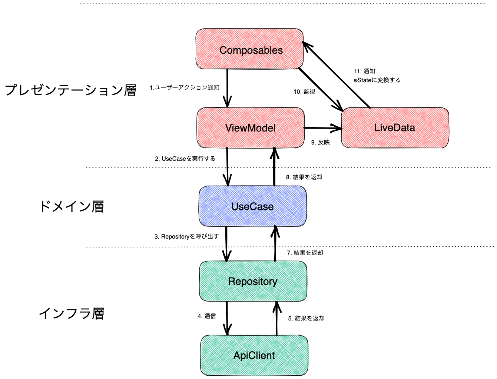
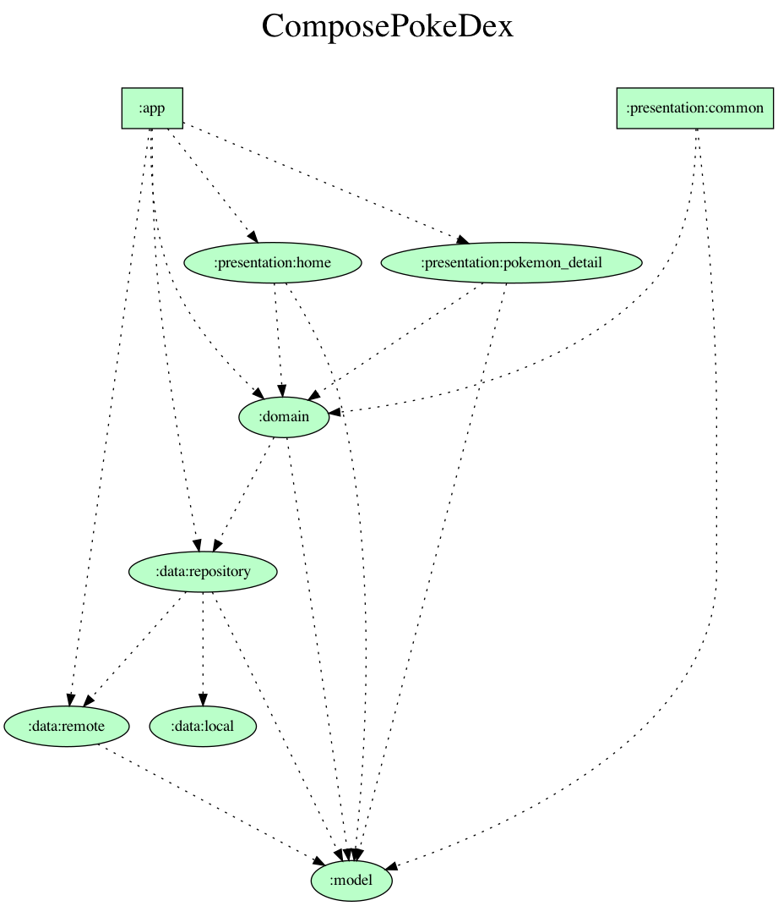

# Compose PokeDex

Compose PokeDexは、Jetpack Composeを使用して実装したポケモン図鑑です。

Home | PokemonDetail
:--: | :--:
 | 

## 使用技術

- Jetpack Compose
- MVVM
- Hilt
- マルチモジュール
- Retrofit2
- Coil

## Requirements

- Android Studio：Arctic Fox beta 4
- Gradle：7.0.2
- Android Gradle Plugin：7.1.0-alpha02
- Kotlin：1.5.10

## アーキテクチャ

### データフロー図


- - -
### モジュール図



### 構成

```sh
$ tree -D -L 2
```

```
.
├── app
│   └── src
├── data
│   ├── local
│   ├── remote
│   └── repository
├── domain
├── model
├── presentation
│   ├── common
│   ├── home
│   └── pokemon_detail
└── shared
```